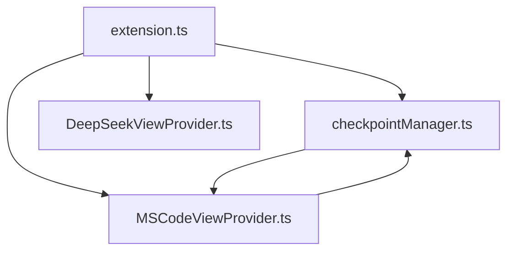

# Architecture Source

## Structure des Fichiers

### 📄 `extension.ts`
Point d'entrée principal de l'extension. Gère :
- Activation/désactivation de l'extension
- Initialisation des composants
- Gestion des canaux de sortie (logs)

### 📄 `checkpointManager.ts`
Gestionnaire central des checkpoints :
- Sauvegarde et restauration des états
- Gestion de l'historique
- Mini-map des modifications
- Timelines de fichiers

### 📄 `MSCodeViewProvider.ts`
Interface utilisateur principale :
- Affichage des checkpoints
- Visualisation des différences
- Gestion des actions utilisateur
- Intégration avec le gestionnaire de checkpoints

### 📄 `DeepSeekViewProvider.ts`
Interface de l'assistant AI :
- Chat avec DeepSeek
- Analyse de code
- Configuration de l'API
- Gestion des suggestions

## Flux de Données

## Points d'Extension

Pour ajouter de nouvelles fonctionnalités :
1. Créez un nouveau provider dans `src/`
2. Enregistrez-le dans `extension.ts`
3. Ajoutez les contributions dans `package.json`

## Événements Clés

- `onDidChangeTextDocument` : Déclenche la création de checkpoints
- `onDidReceiveMessage` : Communication webview/extension
- `onDidChangeConfiguration` : Gestion des paramètres